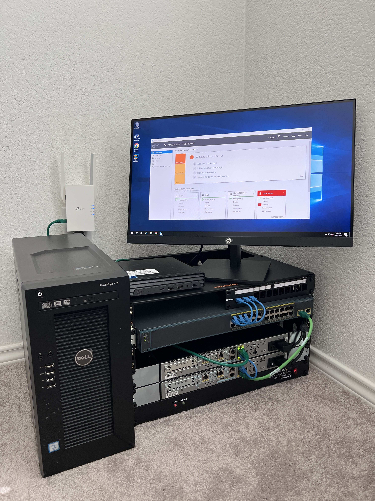

# Introduction
Follow along as I transform my homelab setup and take it from sitting on a cheap shoe rack to a network rack.
# Old Setup

# New Setup

Finished putting together my new network rack!

Unplugged everything from the old setup.

Attached the rack mounts on my routers and switch.

Attached all of my network hardware to the network rack.

Attached the cables.

Final product! I'm very happy with how it turned out, and it is much cleaner than my old setup.

There are still some improvements I am looking to make with this. First being the patch panel, I will upgrade with a full sized patch panel so it properly fits in this rack. Second, I will get a brushed rack mount to fit in between my switch and router so it covers that space but still allows me to run cables.