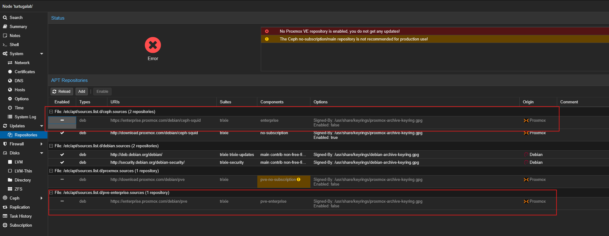
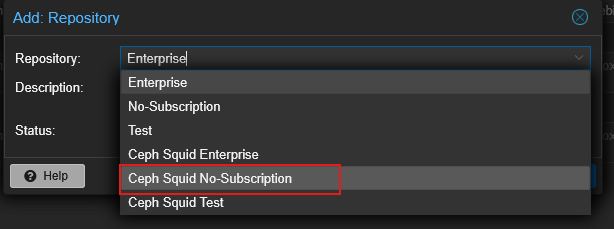
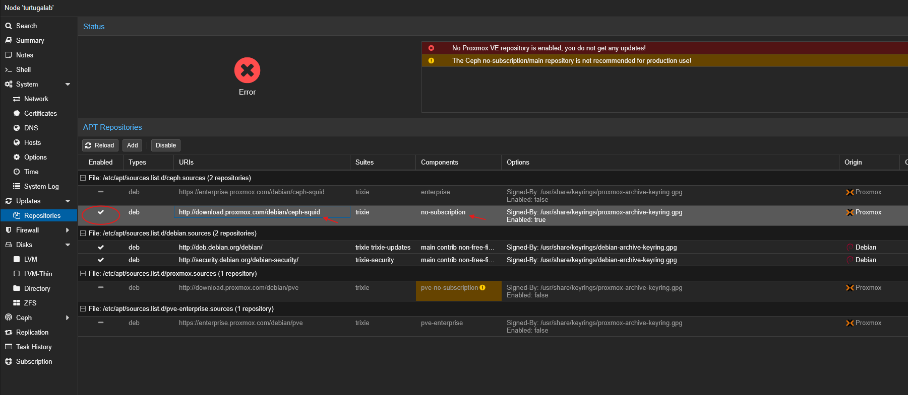
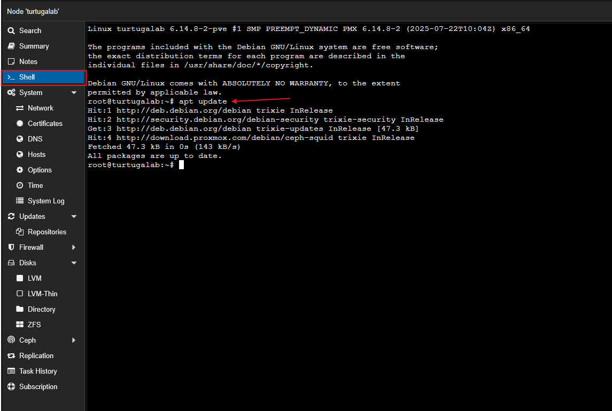

Disable both enterprise repositories since we will be using no subscriptions.




Select a **No subscription** repository and make sure it is enabled.



Go to the Shell screen and run the command:
```cmd
apt update
```
Then,
```cmd
apt upgrade
```

Wait for the update to finish and Proxmox is all up-to-date and ready to go!

Note: If `apt update` fails, edit the DNS configurations and set it to a public DNS like 1.1.1.1 or 8.8.8.8 then try again.