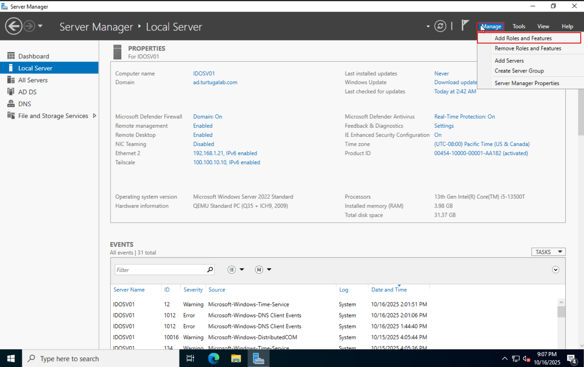
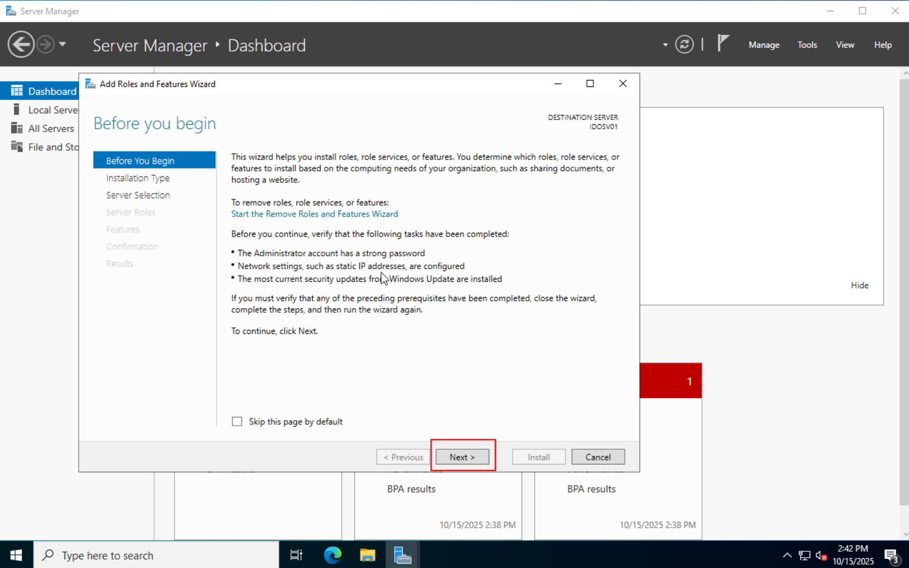
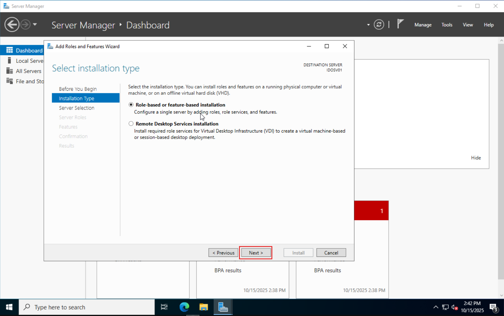
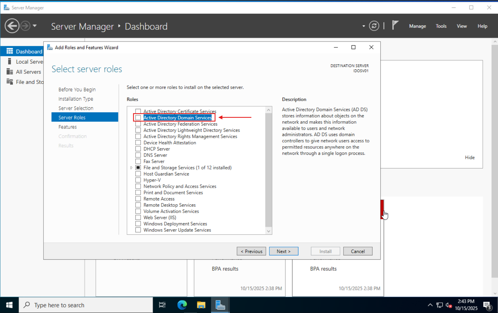
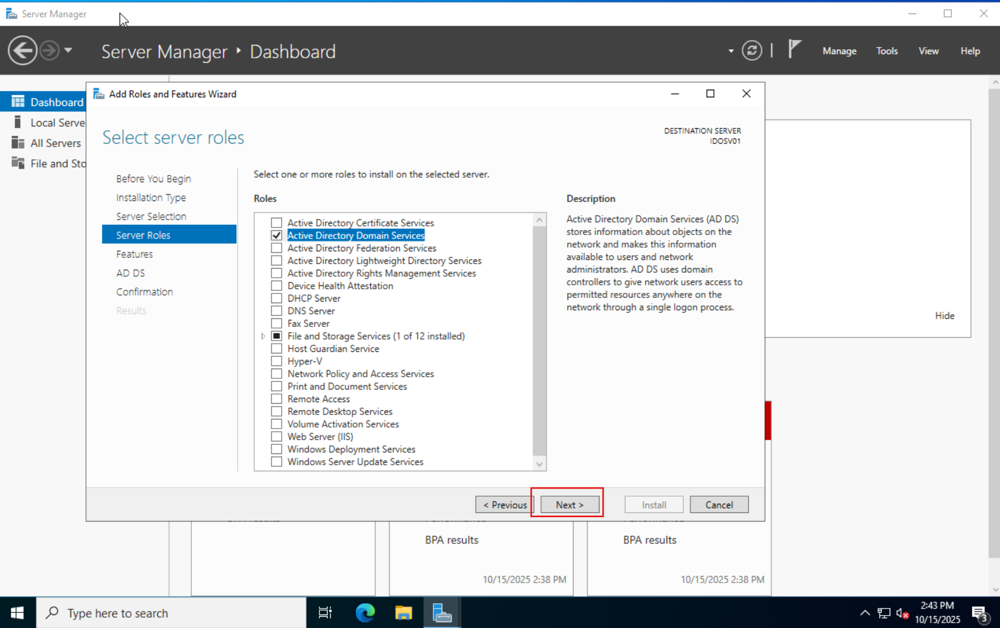
Click through the rest of the setup and install Active Directory.

NOT SHOWN: Once the Active Directory finishes installing, click the flag in the top right hand corner then click on the notification to Promote this system to Domain controller.

Choose new forest and set a fully qualified domain name. I have set mine to **ad.turtugalab.com**.

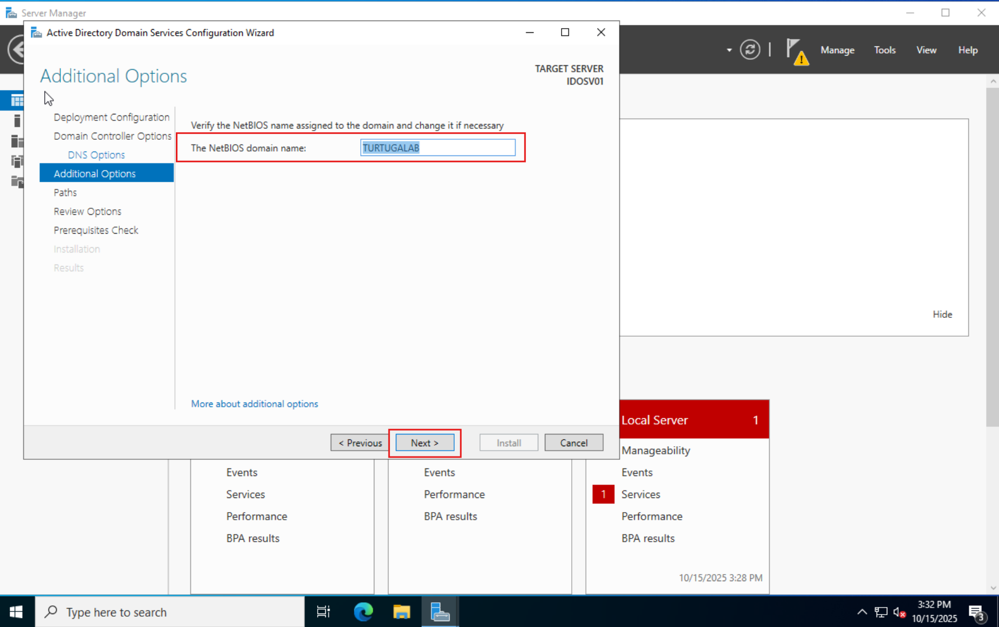

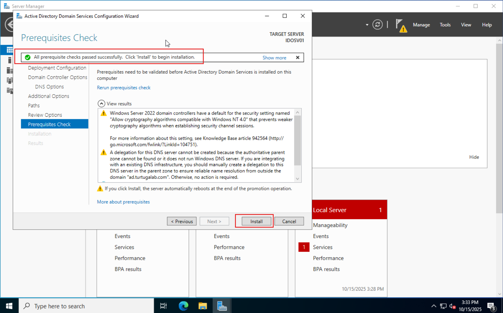

# Configure DNS

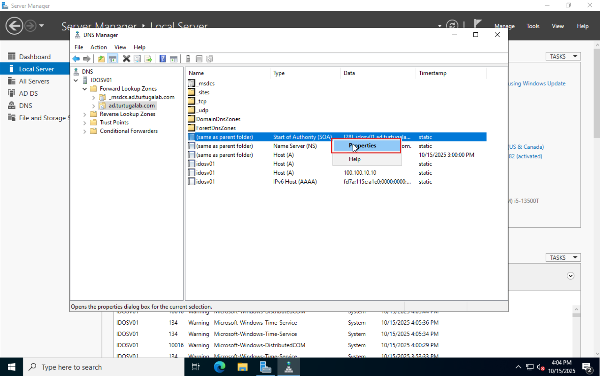
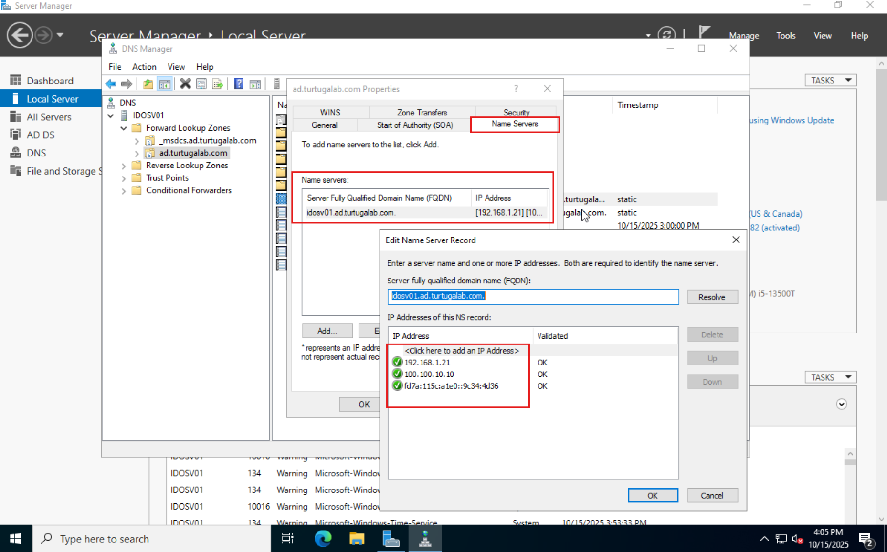
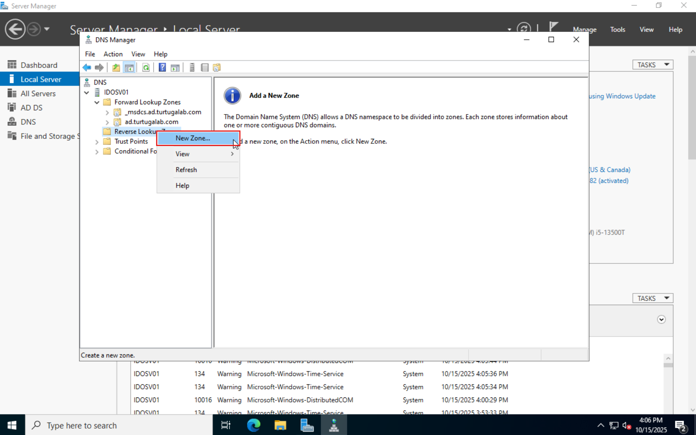
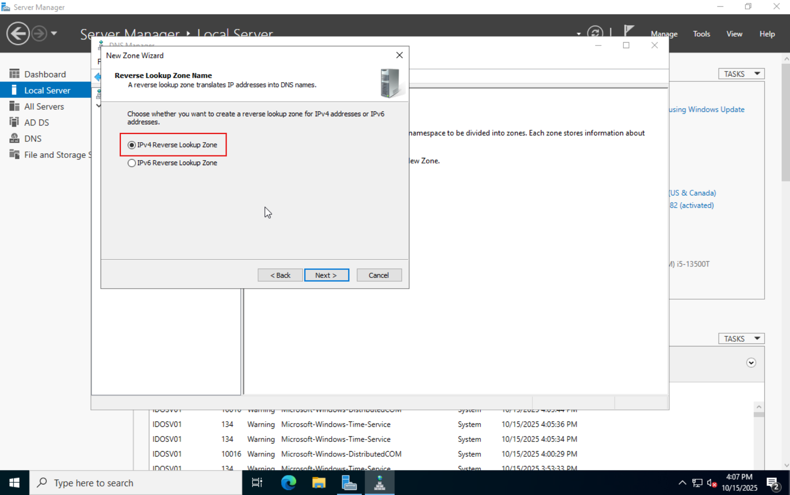
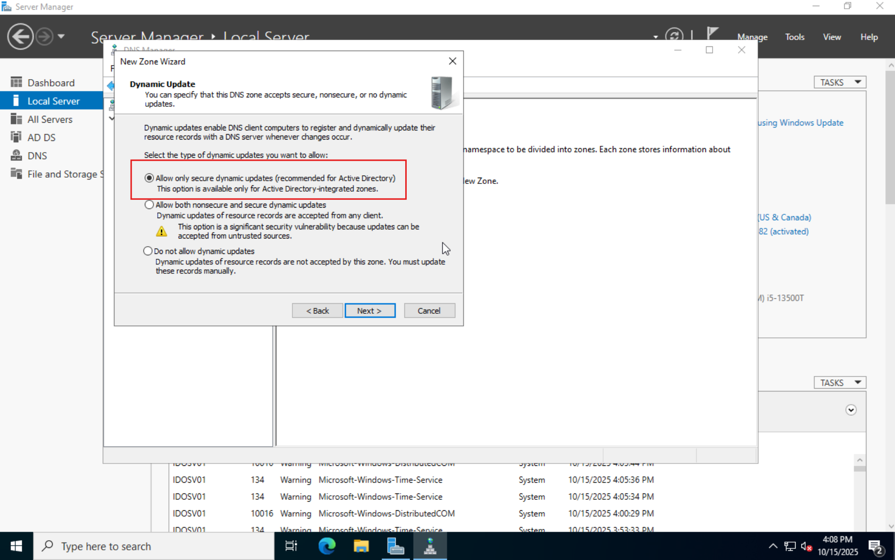
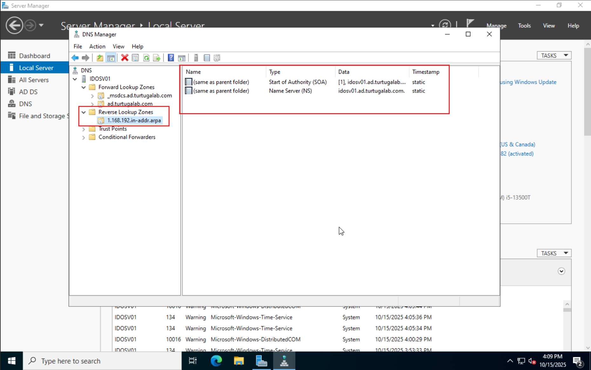
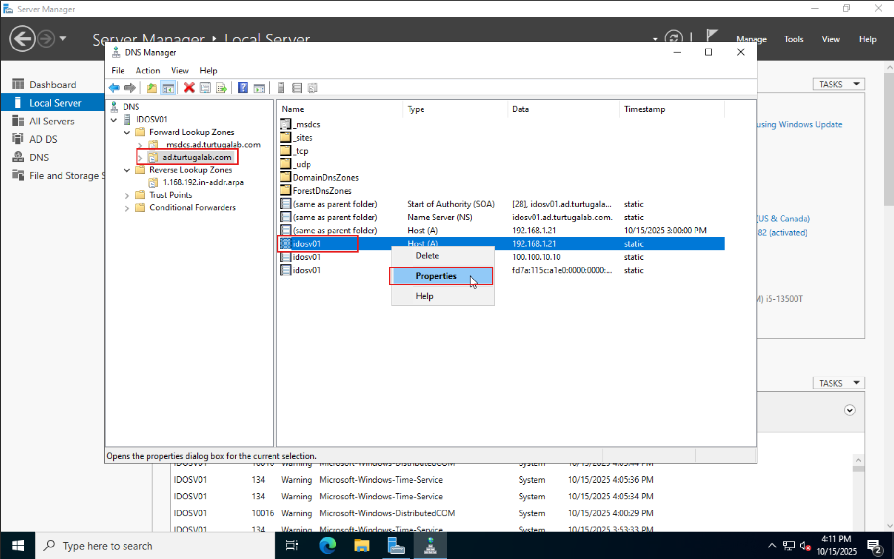
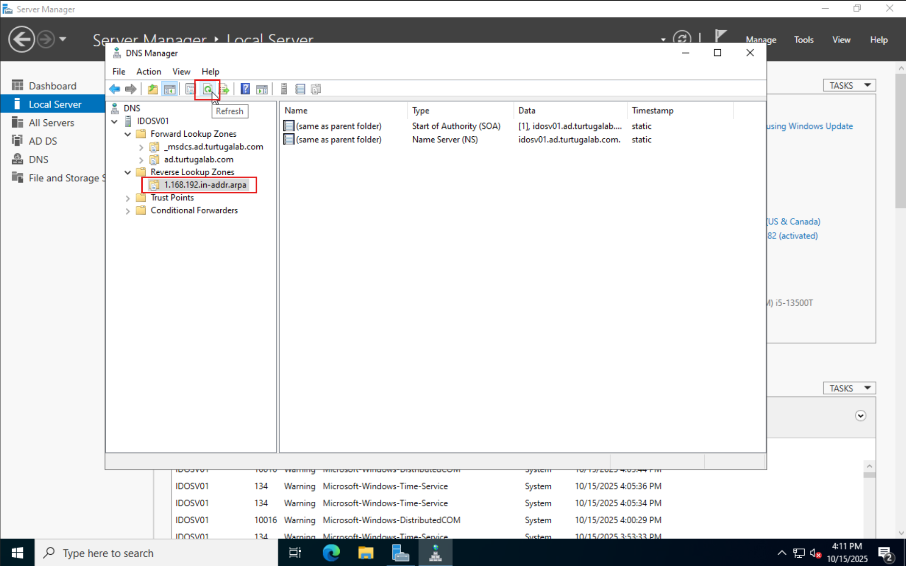

Active Directory is now all set up!