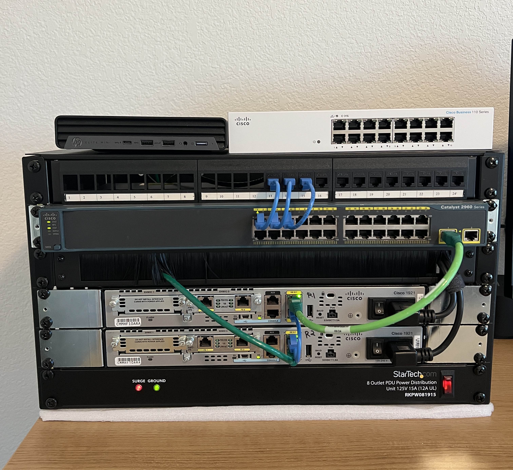
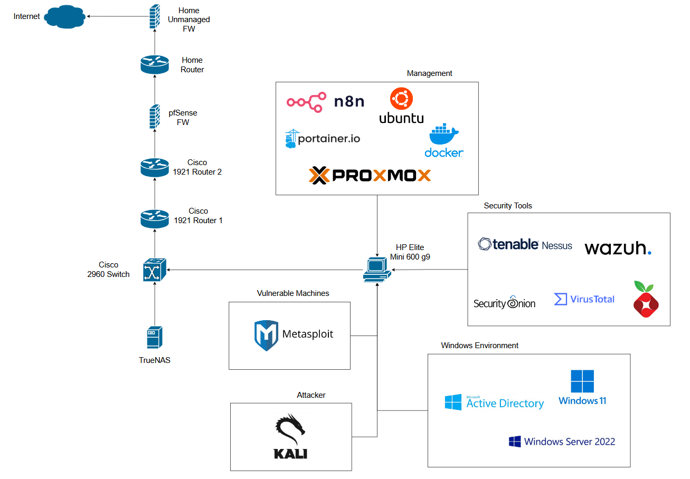
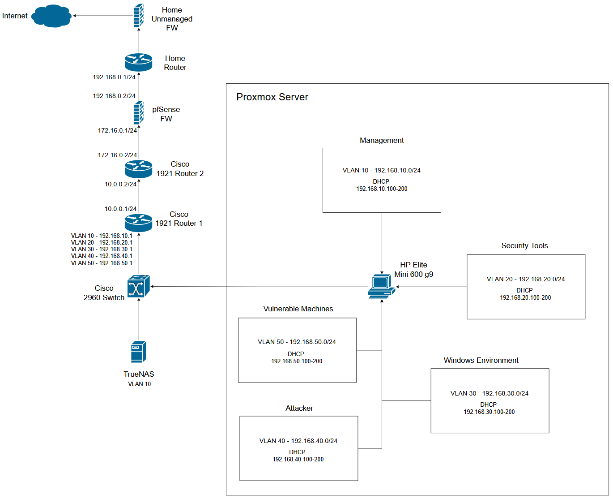

# 🛡️ Cybersecurity Home Lab

This repository is all about a Security Operations Center (SOC) lab built to simulate real-world security operations. It runs on a Proxmox VE infrastructure and integrates multiple tools, including Wazuh, Security Onion, Pi-hole, n8n, Tenable Nessus, Kali Linux, and more. The lab is designed for hands-on practice in monitoring, detection, incident response, and automation.

All configurations, architectures, and findings are documented in Obsidian and synced with this repository for analysis and continuous learning.

---

# 🧱 Lab Architecture
## Physical Hardware

## Lab Design

## Network Design

---

# 🔧 Tech Stack

| Component            | Purpose                                                                                                                                                                 |
| -------------------- | ----------------------------------------------------------------------------------------------------------------------------------------------------------------------- |
| **Proxmox VE**       | Hypervisor platform for hosting and managing all virtual machines in the lab environment.                                                                               |
| **Kali Linux**       | Penetration testing and offensive security distribution used for ethical hacking, vulnerability testing, and exploit simulation.                                        |
| **Docker**           | Container platform for running lightweight, isolated services and applications.                                                                                         |
| **Portainer**        | Web-based Docker management tool for deploying and managing containers easily.                                                                                          |
| **Ubuntu Server**    | Linux server used for hosting docker.                                                                                                                                   |
| **Active Directory** | Directory service used to simulate domain controller functionality, centralized identity management, and group policy.                                                  |
| **Windows 11**       | Simulates a user/target workstation for endpoint testing, phishing and social engineering exercises, Active Directory client behavior, and post-exploitation scenarios. |
| **n8n**              | Automation and orchestration platform used to build workflows and integrate different tools within the lab.                                                             |
| **Wazuh**            | SIEM and endpoint security platform for log collection, intrusion detection, and security monitoring.                                                                   |
| **Security Onion**   | Network security monitoring and intrusion detection platform for packet analysis and threat hunting.                                                                    |
| **Tenable Nessus**   | Vulnerability scanner for identifying and assessing security weaknesses in hosts and networks.                                                                          |
| **Pi-hole**          | Network-wide DNS sinkhole used for ad blocking, DNS filtering, and traffic visibility.                                                                                  |
| **VirusTotal**       | Threat intelligence integration for analyzing suspicious files and URLs using multiple antivirus engines.                                                               |
| **Metasploitable 2** | Intentionally vulnerable Linux VM for penetration testing practice and exploit simulation.                                                                              |
| **Metasploitable 3** | Intentionally vulnerable Windows VM for more complex penetration testing and red team scenarios.                                                                        |

---

# 🚀 Setup Guide
- [Proxmox VE Server Setup](001-Proxmox/README.md)
- [Active Directory Setup](002-ActiveDirectory/README.md)
---

# 📂 Resources
1. Proxmox VE: https://www.proxmox.com/en/
2. Kali Linux: https://www.kali.org/
3. Windows Server 2022: https://www.microsoft.com/en-us/evalcenter/download-windows-server-2022
4. Wazuh: https://wazuh.com/
5. Security Onion: https://securityonionsolutions.com/
6. Tenable Nessus: https://www.tenable.com/downloads/nessus?loginAttempted=true
7. Pi-hole: https://pi-hole.net/
8. Metasploitable 2: https://docs.rapid7.com/metasploit/metasploitable-2/
