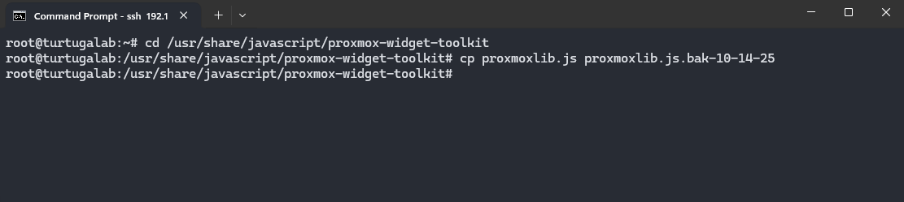
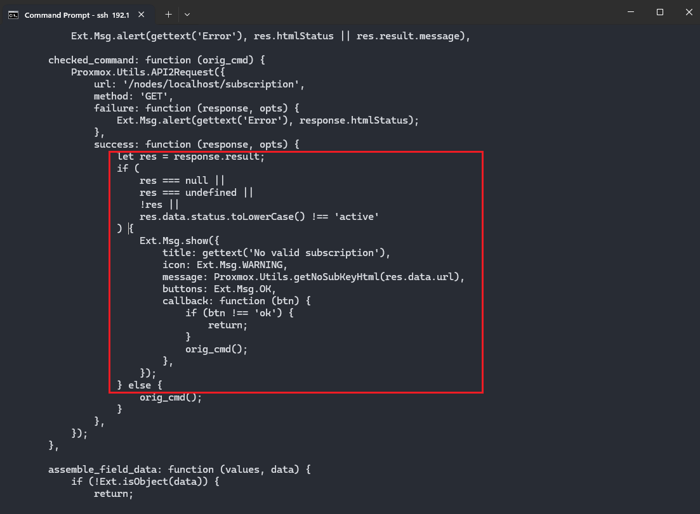
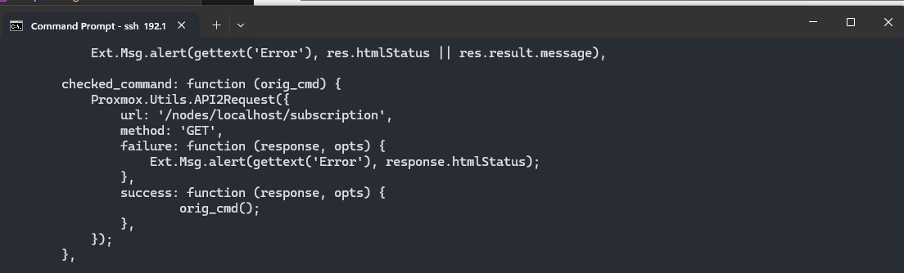
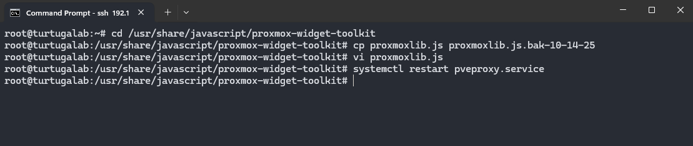

## Prerequisite
This already assumes Proxmox is installed on the hardware.

Tools:
- Rufus
- Proxmox

## Initial Configurations
When you first open Proxmox, you will get a pesky subscription notification. We will turn this notification off permanently.

To do so, we can SSH into the Proxmox server using any SSH tools like MobaXterm or PuTTY. I will use the Command Prompt to SSH into my Proxmox server.

In Command prompt, run the command:
```cmd
ssh [PROXMOX_SERVER_IP_ADDRESS] -l root
```

Where *PROXMOX_SERVER_IP_ADDRESS* is the IP address of the Proxmox server.

Enter the admin password for the root user in the Proxmox server. Once access is granted, run the command:
```cmd
cd /usr/share/javascript/proxmox-widget-toolkit
```

This will change the current working directory to the proxmox-widget-toolkit directory which is where the proxmoxlib.js is located.

Next, create a backup of the proxmoxlib.js using the command:
```cmd
cp proxmoxlib.js proxmoxlib.js.bak-10-14-25
```


Once you have a backup, run this command to edit the proxmoxlib.js:
```cmd 
vi proxmoxlib.js
```
Note: This is using *vim* to edit. Other tools like *neovim* may be used.

Once in the vim editor, type / then "No valid" to find in the file a text containing "No valid".
```cmd
/No valid
```

Once we find this function, delete 16 lines starting from `let res = response.result;`

This should be the end result.

Run this command to write the new changes and exit vim:
```cmd
:wq
```



Now we will restart the proxmox service running this command:
```cmd 
systemctl restart pveproxy.service
```

After completing these steps, when you open Proxmox in the web browser, it will no longer pop up the licensing notification.
